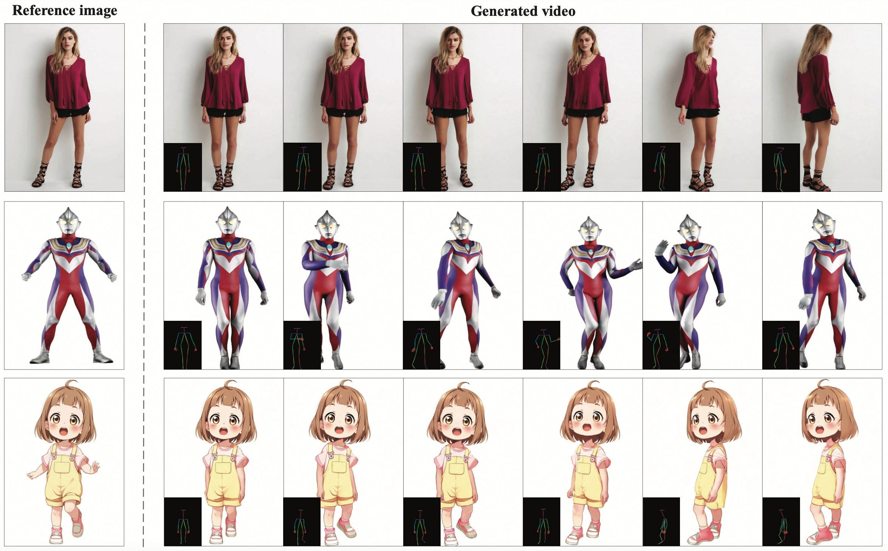
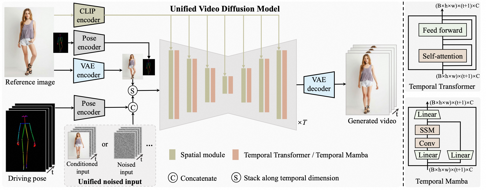

<!-- main documents -->


<div align="center">


# UniAnimate: Taming Unified Video Diffusion Models for Consistent Human Image Animation

[Xiang Wang](https://scholar.google.com.hk/citations?user=cQbXvkcAAAAJ&hl=zh-CN&oi=sra)<sup>1</sup>, [Shiwei Zhang](https://scholar.google.com.hk/citations?user=ZO3OQ-8AAAAJ&hl=zh-CN)<sup>2</sup>, [CHangxin Gao](https://scholar.google.com.hk/citations?user=4tku-lwAAAAJ&hl=zh-CN)<sup>1</sup>, [Jiayu Wang](#)<sup>2</sup>, [Xiaoqiang Zhou](https://scholar.google.com.hk/citations?user=Z2BTkNIAAAAJ&hl=zh-CN&oi=ao)<sup>3</sup>, [Yingya Zhang](https://scholar.google.com.hk/citations?user=16RDSEUAAAAJ&hl=zh-CN)<sup>2</sup> , [Luxin Yan](#)<sup>1</sup> , [Nong Sang](https://scholar.google.com.hk/citations?user=ky_ZowEAAAAJ&hl=zh-CN)<sup>1</sup>  
<sup>1</sup>HUST &nbsp; <sup>2</sup>Alibaba Group &nbsp; <sup>3</sup>USTC


[🎨 Project Page](https://unianimate.github.io/)


<p align="middle">
  

  Demo cases generated by the proposed UniAnimate
</p>


</div>

## 🔥 News 
- **[2024/06/03]** We initialized this github repository and planed to release the paper. 


## Introduction

<div align="center">
<p align="middle">
  

  Overall framework of UniAnimate
</p>
</div>

Recent diffusion-based human image animation techniques have demonstrated impressive success in synthesizing videos that faithfully follow a given reference identity and a sequence of desired movement poses. Despite this, there are still two limitations: i) an extra reference model is required to align the identity image with the main video branch, which significantly increases the optimization burden and model parameters; ii) the generated video is usually short in time (e.g., 24 frames), hampering practical applications. To address these shortcomings, we present a UniAnimate framework to enable efficient and long-term human video generation. First, to reduce the optimization difficulty and ensure temporal coherence, we map the reference image along with the posture guidance and noise video into a common feature space by incorporating a unified video diffusion model. Second, we propose a unified noise input that supports random noised input as well as first frame conditioned input, which enhances the ability to generate long-term video. Finally, to further efficiently handle long sequences, we explore an alternative temporal modeling architecture based on state space model to replace the original computation-consuming temporal Transformer. Extensive experimental results indicate that UniAnimate achieves superior synthesis results over existing state-of-the-art counterparts in both quantitative and qualitative evaluations. Notably, UniAnimate can even generate highly consistent one-minute videos by iteratively employing the first frame conditioning strategy.


## Code 
coming soon...


## Citation

If you find this codebase useful for your research, please cite the following paper:

```
@article{wang2024unianimate,
      title={UniAnimate: Taming Unified Video Diffusion Models for Consistent Human Image Animation},
      author={Wang, Xiang and Zhang, Shiwei and Gao, Changxin and Wang, Jiayu and Zhou, Xiaoqiang and Zhang, Yingya and Yan, Luxin and Sang, Nong},
      journal={arXiv},
      year={2024}
}
```


## Disclaimer

This project is intended for academic research, and we explicitly disclaim any responsibility for user-generated content. Users are solely liable for their actions while using the generative model. The project contributors have no legal affiliation with, nor accountability for, users' behaviors. It is imperative to use the generative model responsibly, adhering to both ethical and legal standards.


